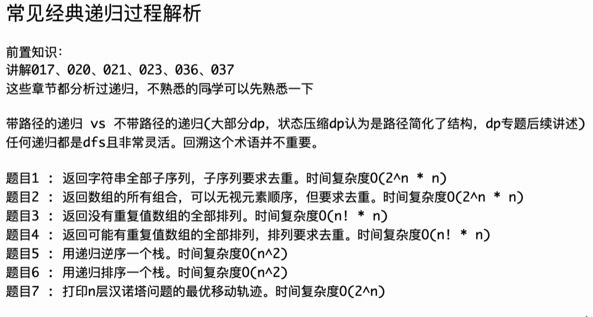
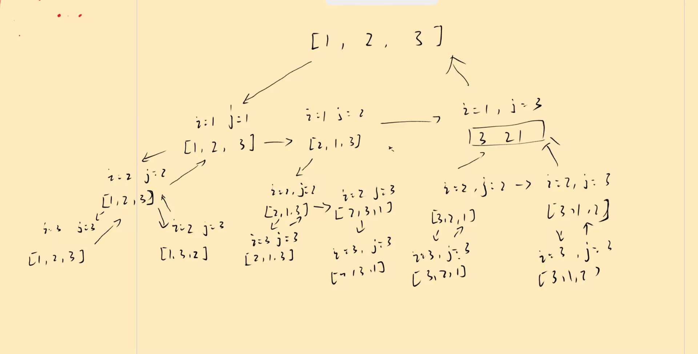

# 递归



#### 1.返回所有不重复子序列  $O(n·2^n)$


```cpp
void f1(string s, int i, string path, unordered_set<string> st){
    if(i == s.size()){
        st.insert(path);
    } else {
        f1(s, i+1, path, st);
        path += s[i];
        f1(s, i+1, path, st);
    }
}
```


#### 2.数组元素的全部不重复组合

同上

#### 全排列生成  $O(n!\cdot n)$



```cpp
vector<vector<int> > ans;

void f1(vector<int>& a, int i) {
    if(i == a.size()) {
        ans.push_back(a);
    }
    for (int j = i; j < a.size(); ++j) {
        swap(a[i], a[j]);
        f1(a, i + 1);
        swap(a[i], a[j]);
    }
}
```

#### 3.数组去重排列


