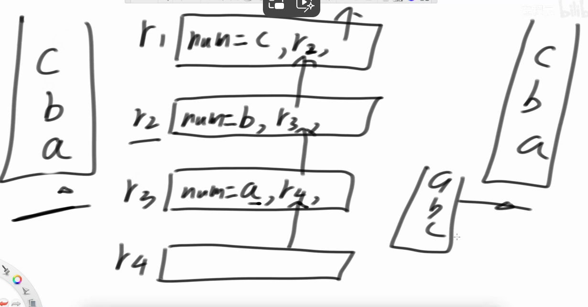
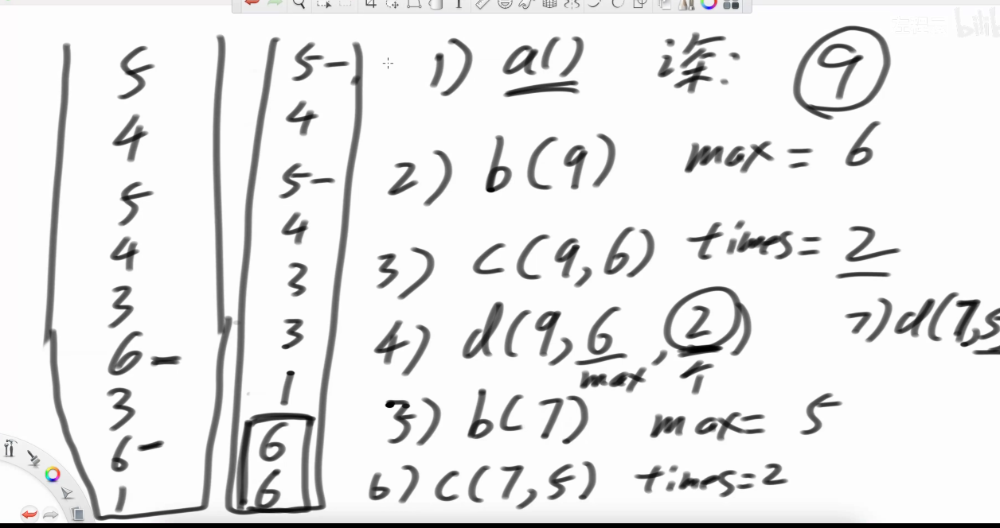
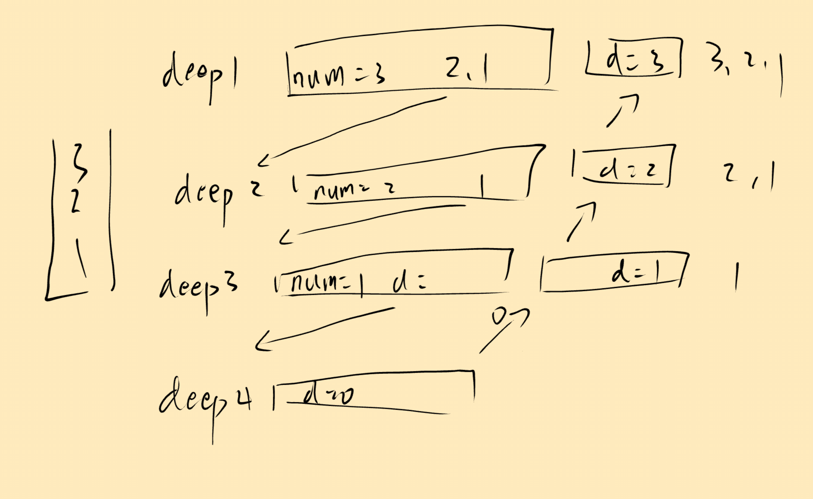
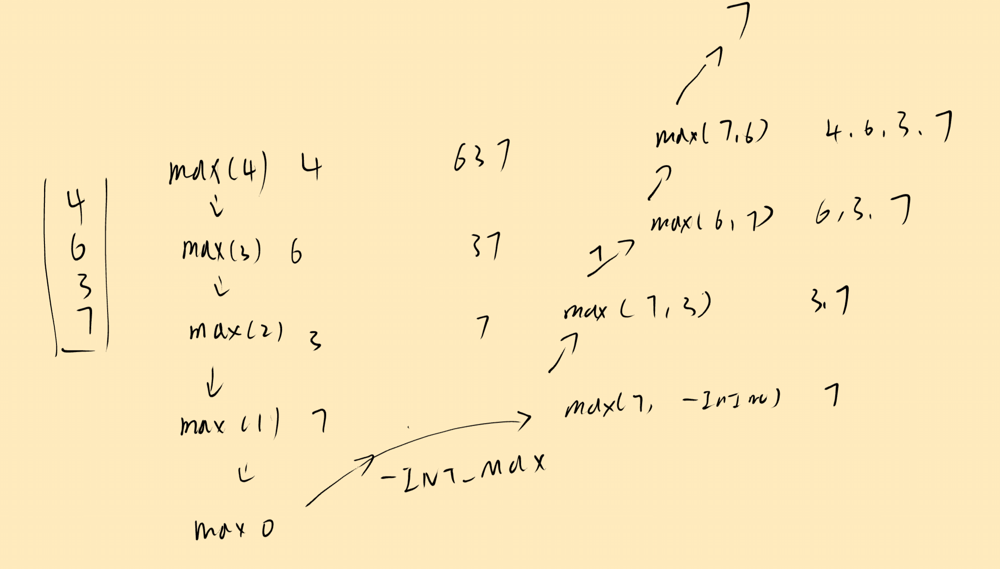
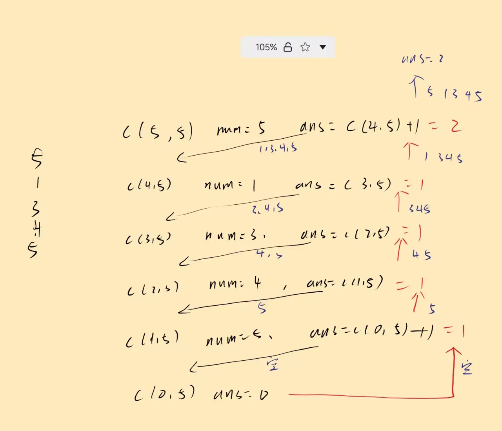
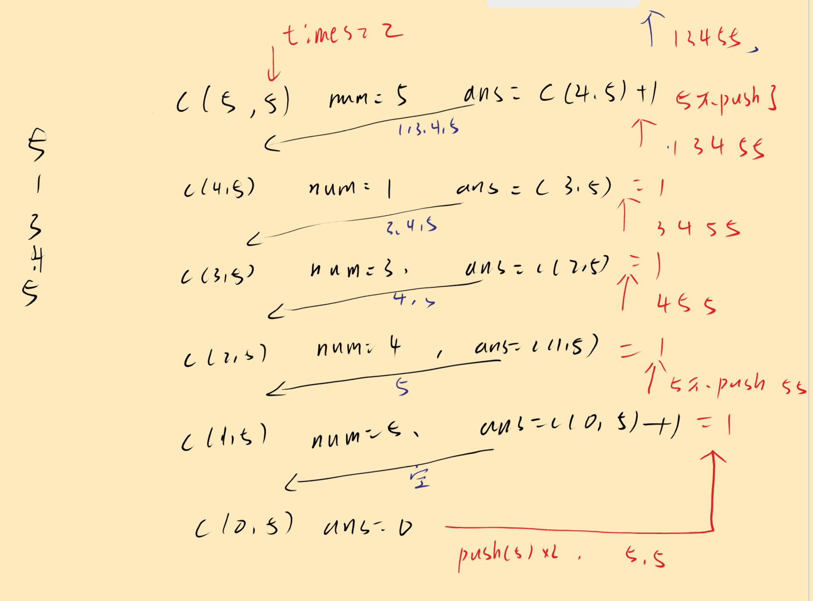

# 递归


#### 1.返回所有不重复子序列  $O(n·2^n)$


```cpp
void f1(string s, int i, string path, unordered_set<string> st){
    if(i == s.size()){
        st.insert(path);
    } else {
        f1(s, i+1, path, st);
        path += s[i];
        f1(s, i+1, path, st);
    }
}
```


#### 2.数组元素的全部不重复组合

同上

#### 3.全排列生成  $O(n!\cdot n)$


```cpp
vector<vector<int> > ans;

void f1(vector<int>& a, int i) {
    if(i == a.size()) {
        ans.push_back(a);
    }
    for (int j = i; j < a.size(); ++j) {
        swap(a[i], a[j]);
        f1(a, i + 1);
        swap(a[i], a[j]);
    }
}
```

#### 4. 数组去重排列 $O(n \cdot !n)$

同上，交换时去重即可,只有没有来到过 $i$ 位置的才交换

```cpp{}
vector<vector<int> > ans;

void f1(vector<int>& a, int i) {
    if(i == a.size()) {
        ans.push_back(a);
    }
    set<int> st;
    for (int j = i; j < a.size(); ++j) {
        if(!st.contain(a[j])){
            st.insert(a[j]);
       		swap(a[i], a[j]);
        	f1(a, i + 1);
        	swap(a[i], a[j]);
        }
    }
}
```


#### 5. 只用递归逆序一个栈  $O(n^2)$

其实就是在递归里创建了十分多变量



```cpp
// o(n)
int bottomout(stack<int> &s) {
    int ans = s.top();
    s.pop();
    if(s.empty()) {
        return ans;
    } else {
        int last = bottomout(s);
        s.push(ans);
        return last;
    }
}
//o(n)
void reverse(stack<int> &s) {
    if(s.empty()) {
        return;
    }
    int num = bottomout(s); // o(n)
    reverse(s);
    s.push(num);
}
```


#### 6. 递归排序栈 $O(n^2)$

不申请辅助结构排序栈




1. 递归函数 $x = a( )$ 统计栈深度 $O(n)$ 

   ```cpp
   // o(n)
   int getdeep(stack<int>& s) {
       if(s.empty()) {
           return 0;
       }
       int num = s.top();
       s.pop();
       int deep = getdeep(s) + 1;
       s.push(num);
       return deep;
   }
   ```

   

2. 递归函数 $y = b(x)$ 统计最大值  $O(n)$ 

   

   ```cpp
   // o(n)
   int stackmax(stack<int> &s, int deep) {
       if (deep == 0) {
           return INT_MIN;
       }
       int num = s.top();
       s.pop();
       int ans = max(num, stackmax(s, deep - 1));
       s.push(num);
       return ans;
   }
   ```

   

3. $z = c(x,y)$ 统计当前深度最大值数量  $O(n)$ 

   

   ```cpp
   // o(n)
   int maxcount(stack<int> &s, int deep, int maxvalue) {
       if(deep == 0) {
           return 0;
       }
       int num = s.top();
       s.pop();
       int ans;
       if(num == maxvalue) {
           ans = maxcount(s, deep - 1, maxvalue) + 1;
       } else {
           ans = maxcount(s, deep - 1, maxvalue);
       }
       s.push(num);
       return ans;
   }
   ```

   

4. $d(x,y,z)$已知最大值，深度，数量，使得最大值放到最底下

   

   ```cpp
   int down(stack<int>& s, int deep, int maxvalue, int times) {
       if(deep == 0) {
           for(int i = 0 ; i < times; ++i) {
               s.push(maxvalue);
           }
       }else {
           int num = s.top();
           s.pop();
           down(s,deep, maxvalue, times);
           if(num != maxvalue) {
               s.push(num);
           }
       }
   }
   ```

   

5. $c(x - z, b(x - z), c(x - z), b(x - z))$ 循环直到 $x=0$

