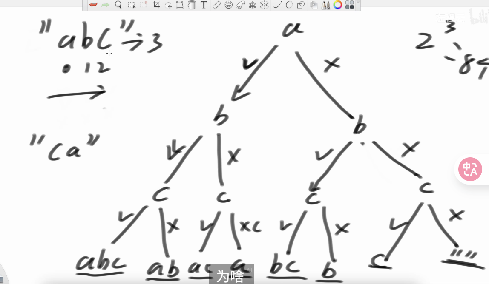

# 递归

### 返回所有不重复子序列  $O(n·2^n)$



```cpp
void f1(string s, int i, string path, unordered_set<string> st){
    if(i == s.size()){
        st.insert(path);
    } else {
        f1(s, i+1, path, st);
        path += s[i];
        f1(s, i+1, path, st);
    }
}
```


